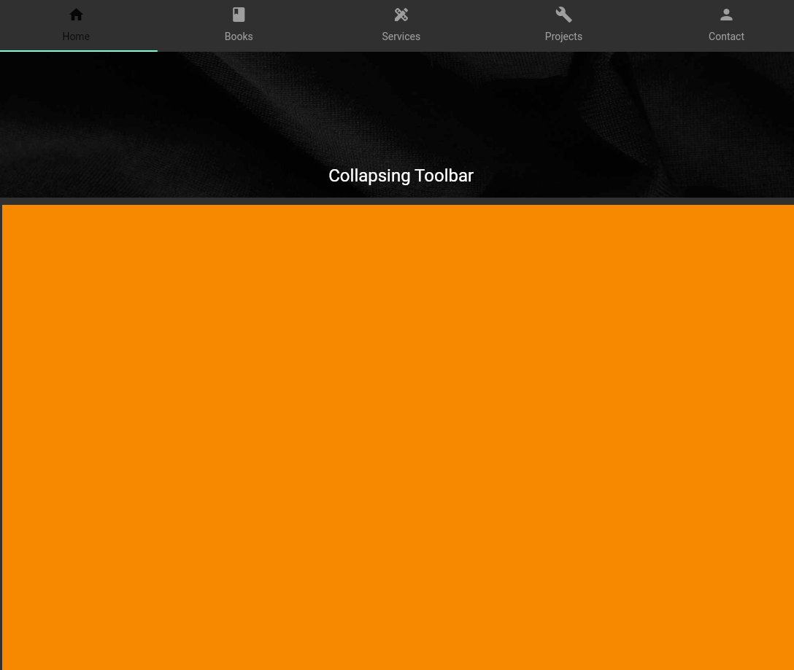

# My Dev WebFolio

Just showing how to dev a web folio using Flutter step-by-step.

## Screenshots And Vids

Mod One Screenshot:

Mod One Video:
[mod one vid](https://youtu.be/OD1LOYWTI7U)

## Follow Me On

Icons by Icons8 dot com.

## Contact

I am somewhat involved in bootstrapping a Flutter Studio in a very specific way. You can contact me via Keybase:

[Fred Grott at keybase](https://keybase.io/fredgrott)
